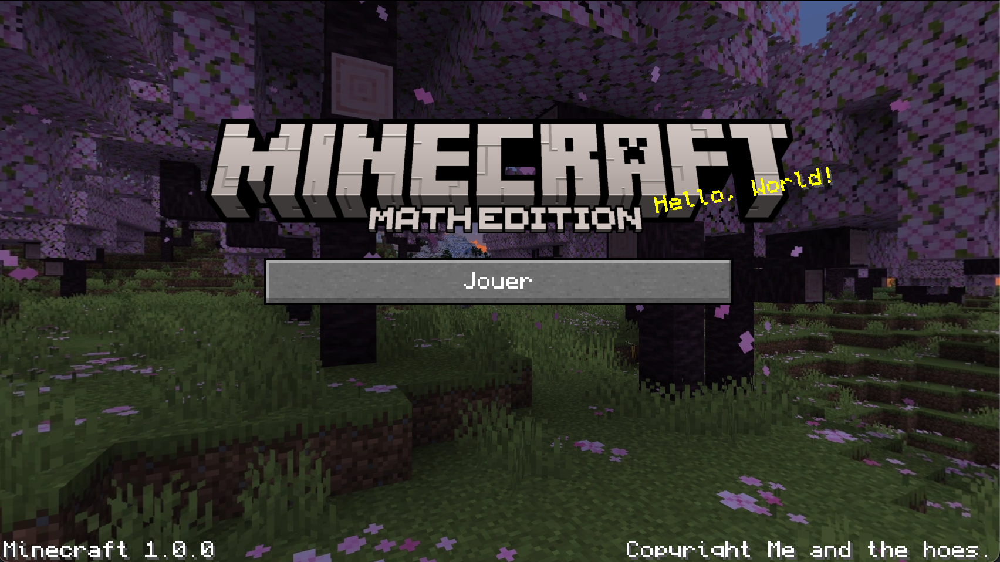

# Minecraft Clone

A Minecraft Clone made with love !


### Built With

- ![Java]
- 

## Getting Started

### Installation

1. Clone the repo

```sh
git clone https://github.com/MathVK/Minecraft_Clone.git
```

2. Open the project in an IDE that supports Maven to install dependencies.

3. Or if you want install them with the following commands:
```sh
mvn clean package
```

### How to play ?

The game can handle two multiplayer modes. Either with a local server that runs on your machine or you can host the game server in a remote host.

1. Configure the client configuration server IP in `res/client_config.json`
```
{
    "ip": "localhost"
    "port": 50000
}
```

2. Compile the server jar with Maven.

```sh
$ mvn clean package
$ java -jar target/minecraft-clone-1.0-SNAPSHOT-jar-with-dependencies.jar
Serveur en écoute sur le port 50000...
```

## What's out the box

**All the JARs are availaible on the `v1.0.0`release tag.** Or if you want you can build them manually with the source code

### Minecraft Clone Server

The server game version needed to connect a client. By default the server port is `50000`. You can change it with the following command.
`java -jar MinecraftServer.jar -p <port>`

### Minecraft Clone Client

The game itself, it needs to be launch at the same root as the `res` folder
```
res/
src/
MinecraftClone.jar
```

The `res` folder contains a `client-config.json` that can be modified to connect to a different server (which is by default `localhost:50000`)

To run the game, you will need an username and a skin PNG. You can use them with the following command :
`java -jar MinecraftClient.jar --name <name> --skin path/to/skin.png`

**Important note for MacOS**

If you are a MacOS user you will need to launch the game client with the `XstartOnFirstThread` JVM option
```
java -jar XstartOnFirstThread MinecraftClient.jar --name <name> --skin path/to/skin.png
```

## License

Distributed under the MIT License. See `LICENSE.txt` for more information.

[Java]: https://img.shields.io/badge/Java-ED8B00?style=for-the-badge&logo=openjdk&logoColor=white